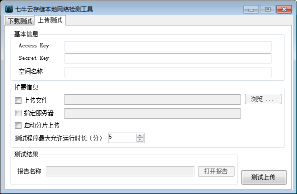
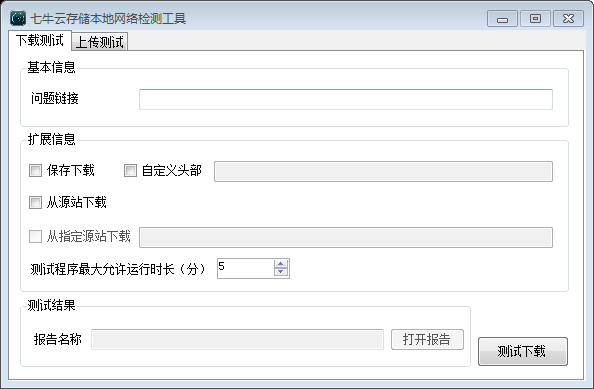

QWebTestTool
============

七牛本地网络环境检测图形界面。

该程序使用Visual Studio 2012编写。运行需要[qwebtest命令](http://developer.qiniu.com/docs/v6/tools/qwebtest.html)的支持。

可以从下面的地址下载编译好的程序：

[QWebTestTool_20141124.zip](http://qdisk.qiniudn.com/QWebTestTool_20141124.zip)

大概是这样：

测试上传，可以什么都不填，直接点击“测试上传”。

测试下载，可以贴一个下载链接，直接点击“测试下载”。

